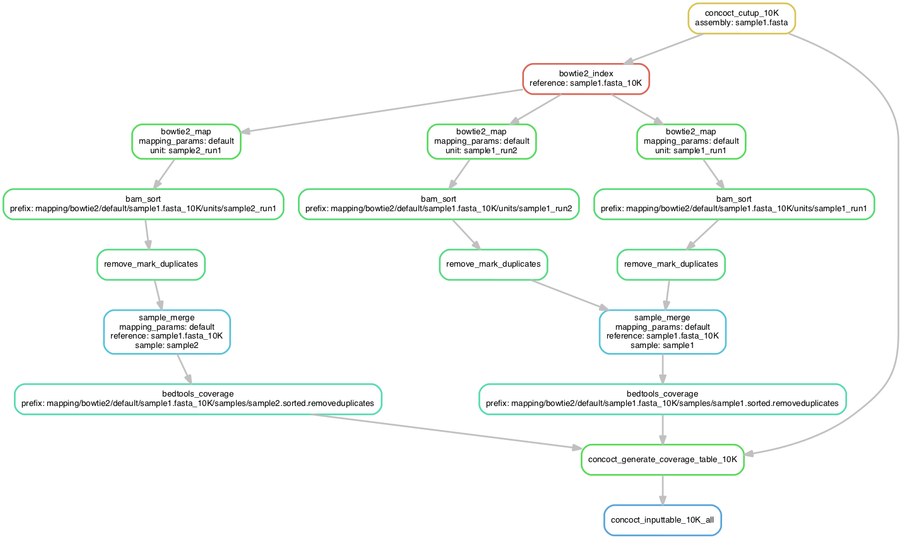

# cookiecutter-binning-project-demo
A demo for the cookiecutter-binning-project repository.

Tutorial
========
Here is a complete example to start and execute a binning project using the cookiecutter-binning-project, snakemake-workflows and toolbox repositories.

Prerequisities
--------------
To set up the proper python environment, install or make sure you have installed [conda](http://conda.pydata.org/miniconda.html). Keep in mind that Conda doesn't play nice if you have virtualenv or virtualenv-wrapper or similar activated. Then create a conda environment:

    conda create -n binning-project-demo python=3.4

Activate this environment:

    source activate binning-project-demo

and install the missing packages

    conda install pip
    pip install cookiecutter snakemake

You're now ready to get started!

Create your binning project
---------------------------
First clone and enter this repository

    git clone https://github.com/EnvGen/cookiecutter-binning-project-demo.git
    cd cookiecutter-binning-project-demo

Then we use cookiecutter to initialize a binning project. Cookiecutter will use the github repo [cookiecutter-binning-project](https://github.com/EnvGen/cookiecutter-binning-project) as a template for your new binning project. Before creating the repo, cookiecutter will ask you for project specific settings. For this demo, it is safest to stick with the suggested default values. To accept the default values, just press return for each parameter cookiecutter asks you to set.

    cookiecutter https://github.com/EnvGen/cookiecutter-binning-project

Enter the newly created binning project directory
    
    cd binning-project

Create a directory for input data that will be ignored by git

    mkdir data

Create links to the test data

    ln -s ../contigs data/
    ln -s ../reads data/

Test if snakemake accepts your input files

    snakemake --dryrun concoct_inputtable_10K_all

Overview of workflow
--------------------
Here are some images to help you understand how the different rules defined in [snakemake-workflows](https://github.com/EnvGen/snakemake-workflows) connect together.

###Generating the inputtable for concoct
To generate an inputtable for concoct, first the assembly will be cut up into smaller pieces and then each sample reads has to be mapped against the cut up assembly. If the sample has been sequenced multiple times, each run will be mapped individually. The output of these mappings will be processed in two steps before merging runs for individual samples and calculating coverage with BEDTools. The graph below shows the details for the assembly of sample1 and reads from sample1 and sample2 where sample1 has been sequenced in two runs. 

